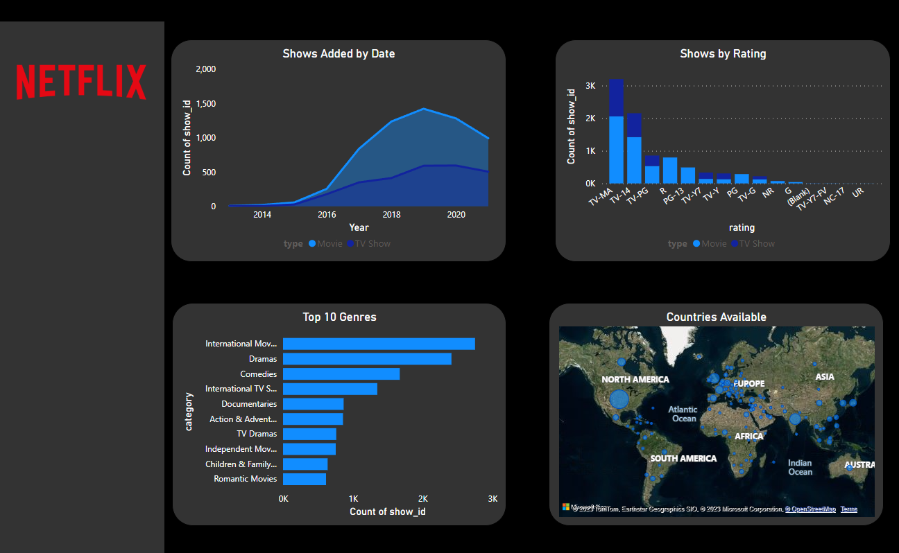

# Netflix-Dashboard

## About the project
- This dataset contains the information about the movies and TV shows added to Netflix. 
  
- The original dataset can be found in Kaggle (https://www.kaggle.com/datasets/shivamb/netflix-shows). The dataset has been transformed using Excel to divide some of its columns, and then perform calculations which can be used for analysis in PowerBI.
  
- Developed a PowerBI dashboard to perform analysis, producing visualisations to draw insights based on different parameters.

  
  .png)
